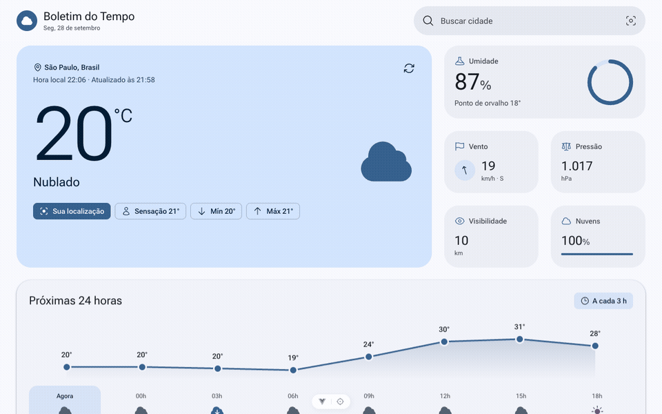

# Boletim do Tempo

Painel de monitoramento do tempo feito com Vue 3, Tailwind CSS 4 e Axios, usando a API da
[OpenWeatherMap](https://openweathermap.org/).



## Requisitos

- Node.js `^22.18.0` ou `>=24.12.0` (o `.nvmrc` fixa a versão 24)
- Uma conta gratuita na OpenWeatherMap

Com o [nvm v0.40.8](https://github.com/nvm-sh/nvm/blob/v0.40.8/README.md#installing-and-updating)
instalado, use a versão do `.nvmrc`
([documentação do `.nvmrc`](https://github.com/nvm-sh/nvm/blob/v0.40.8/README.md#nvmrc)):

```bash
nvm install
nvm use
```

## Configuração

```bash
npm ci
cp .env.example .env
```

1. Crie uma conta em <https://home.openweathermap.org/users/sign_up>.
2. Copie uma chave em <https://home.openweathermap.org/api_keys> (chaves novas podem levar algumas
   horas para ativar).
3. Adicione-a ao `.env`:

   ```dotenv
   VITE_OPENWEATHER_API_KEY=sua_chave_aqui
   ```

4. Inicie o servidor de desenvolvimento e abra <http://localhost:5173>:

   ```bash
   npm run dev
   ```

> [!WARNING]
> Variáveis `VITE_` são embutidas no bundle, então a chave fica visível para qualquer pessoa que use
> o site publicado. Em uma publicação pública, faça proxy da API por um backend que adicione a chave.

## Scripts

| Comando                 | Descrição                                                 |
| ----------------------- | --------------------------------------------------------- |
| `npm run dev`           | Servidor de desenvolvimento                               |
| `npm run build`         | Verifica tipos e gera o build em `dist/`                  |
| `npm run preview`       | Serve o build de produção                                 |
| `npm test`              | Executa os testes                                         |
| `npm run test:watch`    | Executa os testes em modo watch                           |
| `npm run test:coverage` | Executa os testes com cobertura (falha abaixo de 90%)     |
| `npm run lint`          | Oxlint, ESLint (com SonarJS) e verificação do Prettier    |
| `npm run lint:fix`      | Corrige problemas de lint e formatação                    |
| `npm run format`        | Formata com o Prettier                                    |
| `npm run type-check`    | Verifica tipos com `vue-tsc`                              |
| `npm run analyze`       | Análise estática: verificação de tipos, Knip e jscpd      |
| `npm run check`         | Lint, análise, testes com cobertura e build (igual ao CI) |

## Verificações de qualidade

```bash
npm run check
```

O [CI](.github/workflows/ci.yml) executa o mesmo comando no Node 22 e 24. O relatório de cobertura é
gerado em `coverage/index.html`. O ESLint falha em qualquer função com complexidade ciclomática
acima de 6 ou complexidade cognitiva acima de 5, e o jscpd falha em qualquer bloco duplicado.

Cobertura mais recente (192 testes):

| Instruções | Ramos | Funções | Linhas |
| ---------- | ----- | ------- | ------ |
| 100%       | 100%  | 100%    | 100%   |

## Build de produção

```bash
npm run build
```

Publique a pasta `dist/` em qualquer host estático. Defina `VITE_OPENWEATHER_API_KEY` no ambiente de
build e sirva via HTTPS (necessário para a geolocalização do navegador).

## Estrutura do projeto

```text
src/
├── api/          # Cliente e endpoints da OpenWeatherMap
├── components/   # Componentes Vue
├── composables/  # Estado reativo
├── config/       # Ambiente, constantes e mensagens da interface
├── domain/       # Tipos e mapeadores da API para a visualização
├── services/     # Tempo, geolocalização e local salvo
├── utils/        # Formatação e utilitários de horário
├── assets/       # Entrada do Tailwind e design tokens
├── App.vue
└── main.ts
```

Os testes ficam em pastas `__tests__/` ao lado do código. `prototype/index.html` é o protótipo
estático em HTML.

## Solução de problemas

| Sintoma                                    | Solução                                                              |
| ------------------------------------------ | -------------------------------------------------------------------- |
| Tela "Configure a chave da OpenWeatherMap" | Adicione a chave ao `.env` e reinicie o servidor de desenvolvimento. |
| "Chave de API inválida"                    | Confira a chave ou aguarde a ativação.                               |
| "Limite de requisições atingido"           | Aguarde um minuto; o plano gratuito permite 60 chamadas por minuto.  |
| A localização nunca é usada                | Permita o acesso à localização e sirva via HTTPS.                    |
| `SyntaxError ... styleText` ao iniciar     | O Node está desatualizado; execute `nvm use`.                        |
